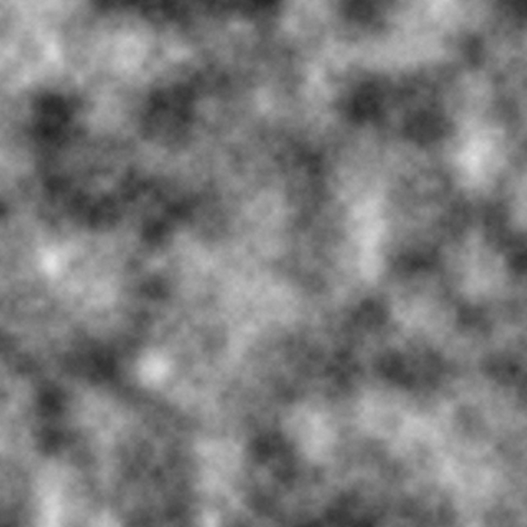

Every person interested in rendering through fragment shaders has already come across a function like this to generate some white noise:

```glsl
float random(vec2 uv) {
    return fract(sin(dot(uv ,vec2(12.9898,78.233))) * 43758.5453);
}
```

And I used it too, until someone pointed out a big problem to me: on her device my artworks were all messed up! And it turned
out that many people were actually encountering the same problem. (You can see the artifacts in the comparison at the end)

<!--truncate-->

After a bit of investigation I tracked it down to the `random` function that was not producing reliable results!
It turned out that depending on the precision of floats supported by your GPU the results were different. For low precision floats the quality of the distribution gets noticeably degraded.

And at this moment I remembered that guy at the bottom of a StackOverflow discussion claiming that his `Gold Noise` was much better.
And guess what, he was right! So thank you Dominic Cerisano for this lovely piece of code!

```glsl
// Gold Noise ©2015 dcerisano@standard3d.com
// - based on the Golden Ratio
// - uniform normalized distribution
// - fastest static noise generator function (also runs at low precision)

float PHI = 1.61803398874989484820459;  // Φ = Golden Ratio   

float gold_noise(in vec2 xy, in float seed){
    return fract(tan(distance(xy*PHI, xy)*seed)*xy.x);
}
```

:::tip
Alternatively, you can rely on https://github.com/ashima/webgl-noise for your Perlin / simplex / fractal / *etc.* noise functions since they don't make use of these pseudorandom number generators.
:::

And here is a comparison of the visual results. `Gold Noise` produces the same (artifact-free) results on all the GPUs I could test with:

|   |Classic white noise|Gold Noise|
|---|---|---|
|**Potato GPU**|||
|**Good GPU**|||

:::info Links
[*The corresponding StackOverflow discussion*](https://stackoverflow.com/questions/4200224/random-noise-functions-for-glsl)<br/>
[*A live comparison of the different types of white noise*](https://www.shadertoy.com/view/fsf3DN)
:::