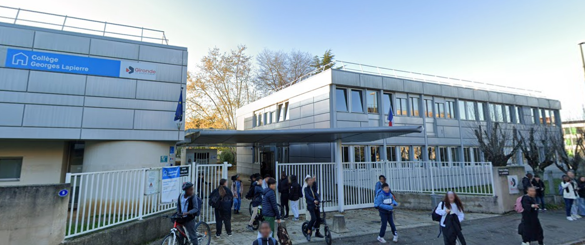

import IFrame from '/src/components/IFrame';
import YoutubeVideo from '/src/components/YoutubeVideo';

<!-- ## Lille VJ Fest (2025 May 15-17)

Anecdote : j'ai pas candidaté assez tôt, ils ont fermé les inscriptions. Puis j'ai envoyé un mail pour forcer et j'ai quand même pû y aller grâce à des désistetements.
Morale / Note to myself: 
- Pas remettre les choses au lendemain
- Faut avoir du culot parfois et tenter / forcer -->

## 👩‍🏫 Summer Internships (2025 May 05 - August 01)

I took three interns this summer:

**Anna-Maria** (Website Overhaul) 
**Elvin** (Automated tests & Scripting API) 
**Anass** (Launcher improvements) 

<!-- TODO take a picture with them at Lille VJ Fest -->

## 📽 Animeet Lyon (Color Space) (2025 April 26-27)

[Animeet](https://linktr.ee/animeet.fr) 
We made a short animation movie in two days. I did the sky in [Coollab](https://coollab-art.com/), the planets, the movement of the ship and the color change animation in Godot.

With Poulpillow and Talia'Kah
<YoutubeVideo url = "b00Np7oSVOY"/>

## 🎮 Game Jam des étoiles (POV Meteor) (2025 April 04-06)

We made a game that was played on a huge dome at the planetarium of [La Cité des Sciences](https://www.cite-sciences.fr/fr/accueil). The biggest challenge was to find a way for all the public to play at the same time. We made a voting system from your phone, were everybody could vote on where the asteroid would go.

[Download the game](https://github.com/JulesFouchy/POV_Meteore/raw/refs/heads/main/Builds/final3bis%202K.zip?download=) 
https://www.cite-sciences.fr/fr/au-programme/activites-spectacles/le-planetarium/game-jam-des-etoiles

With Marie Guillot, Posly, Akarode, August, Frantcho
<YoutubeVideo url = "Vkpi0ViUFbU?start=200"/>

## 👩‍🏫 ENJMIN Game Conference (2025 February 26-28)

I did a 1 hour talk about shader art for the [ENJMIN Game Conference](https://enjmin.cnam.fr/enjmin-game-conferences/enjmin-game-conferences-1111200.kjsp) in Angoulême 

Giving a talk is so nice because afterwards people just come to talk to you about your talk, i.e. subjects you love. I met a ton a very nice people (and promoted Coollab 😇)

[Some resources](https://github.com/JulesFouchy/Faire-de-l-art-avec-des-maths), and my slides (press <kbd>SPACE</kbd> to go to the next slide): 
<IFrame url="https://julesfouchy.github.io/Faire-de-l-art-avec-des-maths/"/>

<!-- TODO -->

## 🥳 Coollab 1.0 Release (2025 February 25)

I finally released the 1.0 version of [Coollab](https://coollab-art.com/)! After 4.5 years of development, with the release of the Launcher I think the software is finally stable enough to go out of the beta phase. (And also I'm starting to have a few users, so I can't break everything all the time anymore 🙄)

## 🎮 Game Jam DS (Platformeuche) (2025 February 14-16)

A platformer almost entirely in the dark (because we didn't want to have to find assets to decorate the level 😇)

[Download the game](https://meucheroume.itch.io/platformeuche)

With MeucheRoume
<YoutubeVideo url = "sS-Hwup0DFA"/>

<!-- ## 😴 Started a regular sleep schedule (2025 February 13)

As of writing this (3 months later) I'm still holding on to it and I really like it. I am now a morning person, working intensely from 8a.m. to 2p.m., then taking a nap, and then chilling for the rest of the day.

<YoutubeVideo url = "ZKNQ6gsW45M"/> -->

## 📽 48-Hour Short Film Challenge (Histoires de Sorcières) (2025 January 17-19)

I did the credit sequence (with [Coollab](https://coollab-art.com/)) in this short movie made by two friends (MeucheRoume and Talia'Kah)

<YoutubeVideo url = "JyoaZSxrji4?start=144"/>

## 🥳 Word It! release (2025 January 02)

After 7 months of development, we released our first mobile game!

With MeucheRoume we wanted to try make a small mobile game and see if we could make some money off of it. We didn't, but it was fun doing my first project with Godot! I really really love this engine, definitely the best for 2D games.

[Download it on the Play Store](https://play.google.com/store/apps/details?id=com.meuchecorp.wordit)

<iframe width="401" height="712" src="https://www.youtube.com/embed/lLnY5TpJuUo" title="[Word It!] Demo" frameborder="0" allow="accelerometer; autoplay; clipboard-write; encrypted-media; gyroscope; picture-in-picture; web-share" referrerpolicy="strict-origin-when-cross-origin" allowfullscreen></iframe>

<!-- 
## Workshops chataigne ?

## Prez coollab ptut à la cité des sciences (et ptut en général) -->

<!-- ## Début club débat -->

<!-- ## Read Thinking fast and slow (2024 December 25) -->

## 👩‍🏫 Coollab workshop for middle school students in Bordeaux (Collège Georges Lapierre) (2024 November 06)

I was invited by a friend who works there (Océane). It was nice to work with young people (13-14 years old), they really enjoyed the images we could make easily with Coollab and all the fun effects.

## 👩‍🏫 Volunteer at OggCamp (2024 October 12-13)

I went to this open-source conference, and decided to volunteer so I would more easily meet some people. I ended up helping speakers setup their computer in the main room, and asking for questions at the end and handing out the microphone

https://oggcamp.org/

## 🎊 Festijam (2024 September 14)

The Festijam is a small independent festival, entirely run by volunteers. I was contacted by Rémi to do a video installation where the public could change some parameters from a small touch screen on the side and see the result live on the screen behind the musicians.
<YoutubeVideo url = "m5ies_OsDD4?start=144"/>

<!-- ## Read Mindful Design -->

## 👩‍🏫 Summer Internships (2024 July - August)

I took five interns for this summer, for small internships because I didn't have money to pay them this year unfortunately:

**Max** (Launcher, Webcam on MacOS) 
**Agathe** (Short tutorial videos, Webcam on Windows) 
**Théo** (Short tutorial videos, Webcam on Windows) 
**Marie** (Short tutorial videos) 
**Aurélien** (Short tutorial videos) 

## 👩‍🏫 Shader Workshop for Creative Code Lab (2024 June 24)

Did a workshop for Creative Code Lab, a meetup about creative coding. I showed the basics of 3D raymarching in ShaderToy. 
[The tutorial](https://github.com/CreativeCodeParis/Workshop/tree/main/GLSL3D)

https://www.instagram.com/p/C8e5Sg1Kaqk/ 

## 🎮 Organizing our own Game Jam (MeucheJam) (2024 June 07-09)

We organized and live streamed our own game jam, because it's fun. 
We also participated and made the prototype for *Word It!*

https://jam.meucheroume.fr/

## 👩‍🏫 Libre Graphics Meeting, Rennes (2024 May 09-12)

A very nice conference for open-source software related to graphics. I presented Coollab during a lightning talk, and met developers of Gimp and Inkscape. Thank you Gimp Foundation for inviting us to the restaurant!

https://libregraphicsmeeting.org/2024/

## 👩‍🏫 Journée d'étude sur le live coding (2024 April 23)

Just went there to see some talks. It was more music-oriented which is not really what I am into, but this is where I discovered the existence of the Libre Graphics Meeting, thanks to a small link at the bottom of a huge presentation slide by Raphaël Bastide. Moral: always go and see stuff, you might be surprised.

https://livecoding.fr/articles/journee

## 🎊 Lille VJ Fest (2024 April 11-13)

I did not participate, but met a ton of amazing people and saw amazing shows. Etidou, Jane, BrHume, Lu7 
I need to participate next year!

https://www.instagram.com/p/DIvqczLM92I/
<YoutubeVideo url = "nBU4WpDwIRI"/>

## 🎊 VJing at WEI IMAC (2023 September 23)

VJing for a party at my school, made with [Coollab](https://coollab-art.com/)

<iframe width="401" height="712" src="https://www.youtube.com/embed/tHI0rycomSM" title="[VJ Set] WEI IMAC 2023" frameborder="0" allow="accelerometer; autoplay; clipboard-write; encrypted-media; gyroscope; picture-in-picture; web-share" referrerpolicy="strict-origin-when-cross-origin" allowfullscreen=""></iframe>

<!-- ## Started streaming with Meucheroume

On https://www.twitch.tv/meucheroume
It's a lot of fun, we just talk about everything (prog, math, science, life philosophy, tons of debates, etc.) -->

## 👩‍🏫 Creative Code Berlin (2023 July 05-17)

I went to Berlin to join the Stammtisch, where I presented Coollab and met some very nice people. They told me about a vvvv meetup so I went there. I discovered vvvv which is a very nice software, met some nice people again. They told me about the TouchDesigner meetup so I went there. I really love Berlin, there are so many creative-coding events! Also the city is very nice, full of gardens and greenery! I really enjoyed wandering around the streets there.

I also went to the Jam and implemented a nice effect that someone showed during the Stammtisch (slit-scan).

<!-- 
## Interns (2023 June)

Théo Couard (Tutorials)
Philippe (Audio)
Tristan (Webcam) -->

<!-- ## cppcon

## 2022-02-18 Game Jam Color

We made a game called *Childchemy* during the [Game Jam Color](https://itch.io/jam/gamejam-color-1). You can play it [here](https://dsmte.github.io/GameJamColor2022).

<IFrame url="https://dsmte.github.io/GameJamColor2022"/>

## Interns (2022 June 11 - August 10)

Anaïs, Lucas, made a huge friend
Jordan
Yvan ??
Paul ??

## Read Prgamatic Programmer

Date == fin stage Ubi

## J'ai envoyé un mail, mntnt je suis prof à l'imac (?)

## Réponse pour devenir prof à l'ICAN

## Started Coollab

## Gamejam cotcot

## Organizing our own game jam: MeucheJam

With @meucheroume
We met Kasenlys!

## Release Django

## Start Spiders

## Stop Spiders

I needed time for personnal projects, and saved up enough money for a year

## Start Smode

Thanks to a conversation in a bar with Lou

## First message from a random in Coollab discrod, i'm so happy ! Same for first artwork by the chinese guy

## Message Discord Tooll

## vj imac au gala 2024, mettre photo groupe avec la team Coollab

## vj imac le premier avec Django

## autres vjing imac ?

## cours processing à l'imac

## orga spectacle poésie à st-louis

## tentative spectacle prépa avec le gars là

## visite TF1 ?

## ISE avec Smode ?

## cours au centre paris anim

## cours à la jonchère

## conf Alpaca

Met ThisXorThat

## atelier shader cookie collectif ?

## tried participating at Lille Videomapping festival

## 48h clémenteam

## 48h conte de fait

## 48h johnny

## Tous les 23h / 25h BD

## Conf philo at ENS

## Saw interstellar

Changed my view of the world, and my life

## Great philo teacher -->