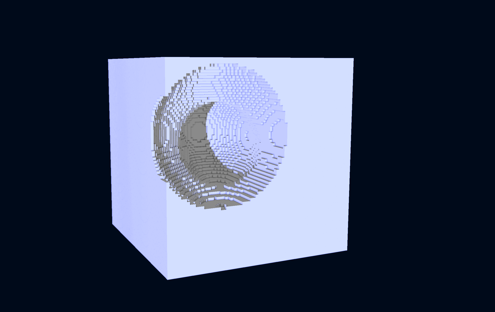

import Image from '@theme/IdealImage';

## Cool

## Django

https://github.com/JulesFouchy/Django

Django is a VJing app based on a particle system. You can play with many settings and shapes, record yourself and export HD videos. It is my biggest project so far.

<iframe width="560" height="315" src="https://www.youtube.com/embed/aqB7xCp21mM" allowfullscreen=""></iframe>
  

## Imacubes

https://github.com/JulesFouchy/IMACUBES/

Imacubes is a voxel editor offering a few tools and procedural terrain generation, supporting custom shaders, shadows and ambient occlusion.
It is my most recent school project.

<iframe width="560" height="315" src="//www.youtube.com/embed/CaTNfpQdocY" allowfullscreen=""></iframe>
  

Here are a few images I made with it:

## Tangram

https://github.com/JulesFouchy/Tangram2

Tangram is a 2D image software mainly focused on the possibility to write your own fragment shaders (in a Shadertoy-like fashion).
I am currently rewritting it from the ground up with an ECS architecture and more solid basis before moving on to more functionalities.

<iframe width="560" height="315" src="//www.youtube.com/embed/ZU_C6q6772Y" allowfullscreen=""></iframe>
  

Here are of few images I made using Tangram:

*Playing around with ray marching:*

## Mirrors, Lasers & Robots

https://github.com/guillaume-haerinck/imac-tower-defense

*Mirrors, Lasers & Robots* is a tower defense game based on redirecting lasers through mirrors.
It was a school project developed as two.

<iframe width="560" height="315" src="//www.youtube.com/embed/jsds0LTW2HE" allowfullscreen=""></iframe>

## Art with code

